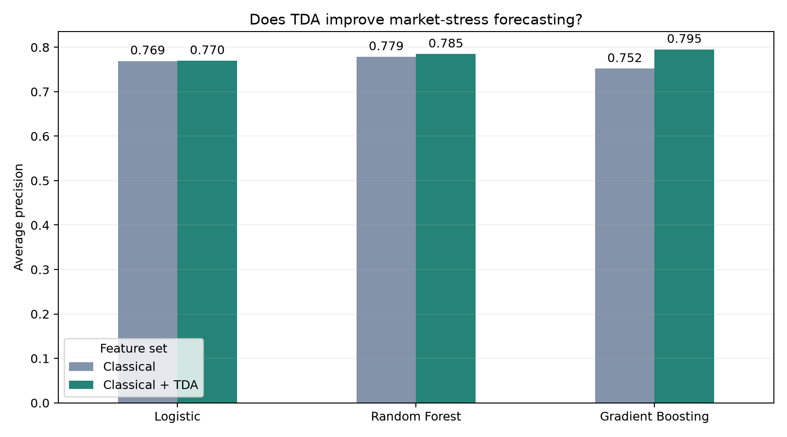

# TDA for Market-Stress Forecasting

Can persistent homology add useful information to standard market features?

This project answers that question with a targeted COVID-regime case study. It predicts whether S&P 500 volatility over the next three trading days will exceed 25%, comparing:

- classical financial features;
- two persistent-homology features;
- classical and topological features together.



## Main result

The models are trained on data before 2019. January 2019 through June 2020 is held out as the final case-study period.

| Model | Classical AP | TDA-only AP | Classical + TDA AP | AP gain | Relative gain |
|---|---:|---:|---:|---:|---:|
| Logistic regression | 0.7692 | 0.6945 | **0.7696** | +0.0005 | +0.1% |
| Random forest | 0.7786 | 0.6382 | **0.7847** | +0.0062 | +0.8% |
| Gradient boosting | 0.7519 | 0.6717 | **0.7951** | **+0.0432** | **+5.7%** |

For gradient boosting, ROC-AUC also rises from 0.9034 to 0.9155.

TDA alone is weaker than the classical benchmark. Its value is complementary: the strongest result comes from giving the model both descriptions of the market.

Four-fold expanding-window validation is also run inside the pre-2019 training sample:

| Model | Classical CV AP | Combined CV AP | AP gain |
|---|---:|---:|---:|
| Logistic regression | 0.4860 | 0.4858 | -0.0003 |
| Random forest | 0.4236 | **0.4311** | +0.0075 |
| Gradient boosting | 0.3943 | **0.4020** | +0.0078 |

The nonlinear models therefore show a positive mean gain in both expanding-window validation and the final case study. Logistic regression is essentially unchanged.

## Small out-of-sample backtest

The prediction model produces a stress probability `p` after each market close. The optional `backtest.py` converts it into a simple defensive allocation:

```text
next-day S&P 500 exposure = 1 - today's stress probability
cash exposure             = today's stress probability
```

The signal is shifted by one trading day, so information from today's close can only affect tomorrow's position. The test also charges 5 basis points for each unit of turnover. It uses no short position and no threshold selected on the test period.

| Strategy | Total return | Annualized return | Volatility | Sharpe | Maximum drawdown |
|---|---:|---:|---:|---:|---:|
| Buy and hold | 23.52% | 15.21% | 28.42% | 0.64 | -33.92% |
| Classical signal | 9.56% | 6.31% | 12.50% | 0.55 | -18.04% |
| Classical + TDA signal | **12.72%** | **8.35%** | **12.46%** | **0.71** | **-17.91%** |

The combined signal improves return and Sharpe over the otherwise identical classical risk overlay. Buy and hold has the highest raw return during this period, but also more than twice the volatility and a much deeper drawdown.

This is the economic-validation step after predictive validation. It asks whether the statistical improvement survives after forecasts are translated into positions, delayed until they are tradable and charged transaction costs.

## Prediction target

At date `t`, the target is one when annualized root-mean-square S&P 500 volatility over days `t+1`, `t+2` and `t+3` exceeds 25%:

```text
future_volatility = sqrt(252 * mean(next three squared returns))
target = 1 if future_volatility > 0.25 else 0
```

This is a stress-classification exercise, not a directional trading strategy. Average precision is the main metric because stress observations are less common than normal observations.

## Classical features

The benchmark uses ten standard features:

- one-day S&P 500 return;
- 5-, 20- and 60-day momentum;
- 5-, 20- and 60-day annualized volatility;
- daily mean sector return;
- daily dispersion across sector returns;
- share of sectors with a negative return.

They are created with ordinary pandas operations such as `rolling`, `sum`, `std` and `mean`.

## Topological features

Each date provides a nine-dimensional vector containing the returns of nine US sector ETFs. The code forms two recent 20-day point clouds and computes their Vietoris-Rips persistence diagrams in dimensions H0 and H1.

The two TDA features are the Wasserstein changes between the earlier and later diagrams:

```text
H0 Wasserstein distance
H1 Wasserstein distance
```

Classical features summarize returns and marginal volatility. The TDA features instead measure how the multivariate shape of the sector-return cloud is changing.

## Evaluation design

- Training: March 1999 to December 2018.
- Validation: four expanding time-series folds, with no shuffling.
- Gap: three observations at each boundary, matching the target horizon.
- Final case study: January 2019 to June 2020.
- Models: logistic regression, random forest and gradient boosting.
- Ablation: classical, TDA only and classical plus TDA.
- Metrics: average precision and ROC-AUC.

The test period is intentionally a targeted regime case study. The result demonstrates that TDA can add predictive value in this example; it is not a claim of universal outperformance in every market period.

## Code structure

The project deliberately uses the same simple structure as the earlier TDA and volatility projects:

1. download prices;
2. calculate returns;
3. create classical features;
4. create two TDA features;
5. build the future target;
6. split chronologically;
7. compare three models and three feature sets;
8. save metrics and a chart.

The main file contains **333 lines**. It has no custom classes, type annotations, JSON handling, command-line parser or parallel-processing layer. The optional backtest is a separate **115-line** file in the same repository, so it can be studied independently.

## Run

```bash
python -m venv .venv
source .venv/bin/activate
python -m pip install -r requirements.txt
python tda_market_crash_predictor.py
python backtest.py
```

The first run downloads adjusted prices and computes the persistence features. Both are saved under `data/` so later runs are faster.

Run the tests with:

```bash
python -m pip install -r requirements-dev.txt
python -m pytest -q
```

## Outputs

```text
results/
  backtest_daily.csv
  backtest_equity.png
  backtest_metrics.csv
  cross_validation_results.csv
  test_results.csv
  test_predictions.csv
  tda_value_added.png
```

## Limitations

- The case-study period contains an exceptional market regime.
- Daily prices omit intraday and options-implied information.
- The ETF universe is fixed through time.
- Overlapping three-day targets are dependent even though split boundaries are purged.
- The backtest assumes zero return on cash and does not model financing, slippage or market impact.
- Classifier probabilities are used directly as risk scores and are not explicitly calibrated.
- This is a feature-engineering demonstration, not an investment strategy.

## References

- Marian Gidea and Yuri Katz, *Topological Data Analysis of Financial Time Series: Landscapes of Crashes*, 2018.
- Hugo Gobato Souto, *Topological tail dependence: Evidence from forecasting realized volatility*, 2023.
- Ulrich Bauer, *Ripser: efficient computation of Vietoris-Rips persistence barcodes*, 2021.
